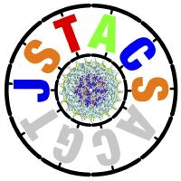

# Jstacs

Jstacs is an open-source Java library for statistical analysis of biological sequences. It provides efficient sequence data structures and a broad set of generative and discriminative models for parameter learning, along with tools to assess and compare classifiers on test datasets or via cross-validation using multiple performance measures.

For more information including an API documentation, code examples, FAQs, binaries and a cookbook visit http://www.jstacs.de.

## Prerequisites

- Java 17
- Apache Maven 3.6+
- Maven downloads dependencies from configured repositories: ensure network access for the first build.

## Repository layout

- `src/main/java` -- core Java sources under the `de.jstacs` package
- `src/main/resources` -- runtime assets (native libs, package docs, etc.)

## Building the jar

This repository builds the core library only (no project modules).

```
mvn clean package
```

To install into your local maven repository:

```
mvn clean install
```

The jar is created at `target/jstacs-core-2.5.0-SNAPSHOT.jar`.

## Organization of the library

Jstacs core classes may be found in sub-packages of de.jstacs.

A list of projects that are based on Jstacs, including binaries documentation of user parameters is available at http://jstacs.de/index.php/Projects.

Building upon Jstacs, [JstacsFX](https://github.com/Jstacs/JstacsFX) visualizes parameters and results in a JavaFX-based GUI that is built upon the generic de.jstacs.tools.JstacsTool class.

## Licensing information

Jstacs is free software: you can redistribute it and/or modify under the terms of the GNU General Public License version 3 or (at your option) any later version as published by the Free Software Foundation.

For more information, please read LICENSE.
