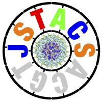

# Jstacs



Jstacs is an open-source Java library for statistical analysis of biological sequences. It provides efficient sequence data structures and a broad set of generative and discriminative models for parameter learning, along with tools to assess and compare classifiers on test datasets or via cross-validation using multiple performance measures.

For more information, including API documentation, code examples, FAQs, binaries, and a cookbook, visit [http://www.jstacs.de](http://www.jstacs.de).

## Prerequisites

- Java 17+
- Apache Maven 3.6+
- Network access for Maven dependency resolution on the first build

## Building

Build the core library:

```bash
mvn clean package
```

Install it into your local Maven repository:

```bash
mvn clean install
```

By default, Javadoc generation is skipped during regular builds and installs.

## Javadoc

Generate HTML Javadoc in `target/site/apidocs`:

```bash
mvn javadoc:javadoc -Dmaven.javadoc.skip=false
```

Build and attach the Javadoc JAR:

```bash
mvn javadoc:jar -Dmaven.javadoc.skip=false
```

## Repository layout

- `src/main/java` — core Java sources under the `de.jstacs` package
- `src/main/resources` — runtime assets such as native libraries and package documentation

## Organization of the library

Jstacs core classes are located in sub-packages of `de.jstacs`.

A list of projects based on Jstacs, including binaries and documentation of user parameters, is available at [http://jstacs.de/index.php/Projects](http://jstacs.de/index.php/Projects).

[JstacsFX](https://github.com/Jstacs/JstacsFX) provides a JavaFX-based GUI built around the generic `de.jstacs.tools.JstacsTool` class.

## Contributing

Development, testing, pull request, and release instructions are documented in [CONTRIBUTING.md](CONTRIBUTING.md).

## License

Jstacs is free software distributed under the terms of the GNU General Public License version 3, or any later version.

See [LICENSE](LICENSE) for details.